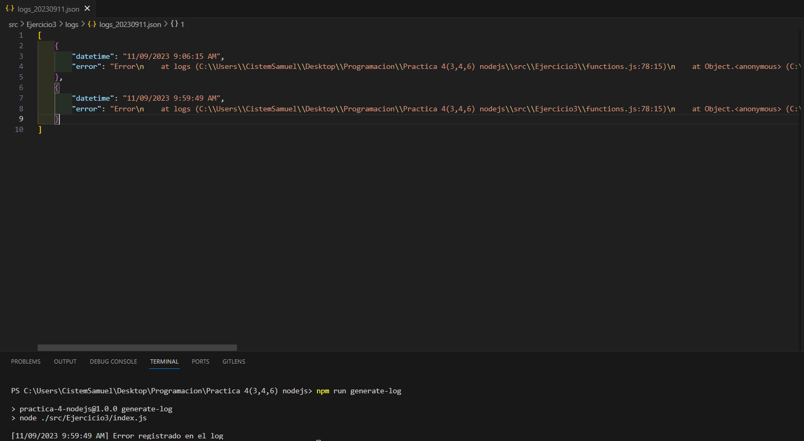
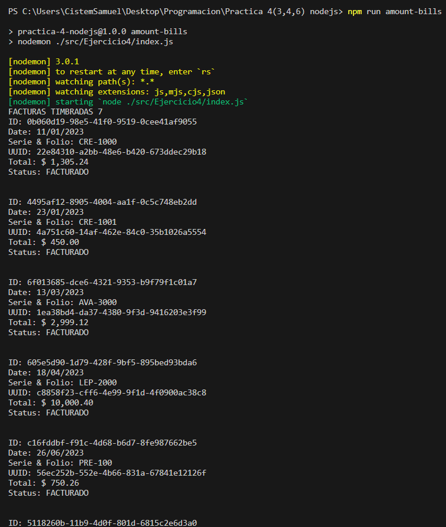
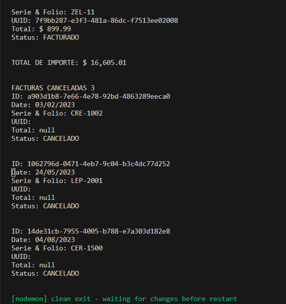
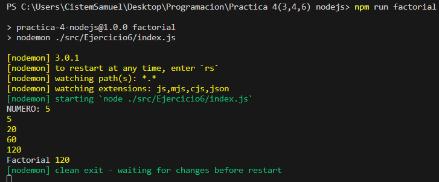

# **Tres Practicas**

- ✨ **[Practica 3](./src/Ejercicio3/requeriments.md)**: Creación de logs por errores generados.
- ✨ **[Practica 4](./src/Ejercicio4/requeriments.md)**: Determinación de facturas timbradas y canceladas.
- ✨ **[Practica 6](./src/Ejercicio6/requeriments.md)**: Determinación del factorial de un numero.

## **Verificación de Requisitos**

- ✨ **Verificar Node**: 

    ```bash
    node -v
    ```

    > **NOTA**: En caso de no contar con la instalación de Node.js acceda al siguiente enlace **[NODE.JS](https://nodejs.org/es)**, y con el siguiente comando podra determinar si se hizo la instalación correcta:
    >
    >Muestra las versiones de las tecnologias instaladas:
    >
    >```proweshell
    >    npm -v 
    >    node -v
    >```

## **Pasos de Instalación**

Siga estos pasos para instalar y ejecutar el proyecto localmente:

1. Clone el siguiente repositorio:

    ```proweshell
    git clone https://github.com/SamuelCM123/tresPracticas.git
    ```

2. Desplazarse al proyecto:

    ```bash
    cd "tresPracticas"
    ```

3. Instalar los módulos de Node:

    ```bash
    npm install
    ```

4. Abrir el proyecto en un editor de código:

    > **NOTA**: Se recomienda, que se utilice **[Visual Studio Code](https://code.visualstudio.com/download)**. De tenerlo, use el comando `code .`

5. Abrir una terminal y escribir algunos de los siguientes comandos:

- Practica 3: Log de errores:

    ```bash
    npm run generate-log
    ```

    <div align="center">
        
    </div>

- Practica 4: Formateo de facturas:

    ```bash
    npm run amount-bills
    ```

    <div align="center">
        
    </div>
    <div align="center">
        
    </div>

- Practica 6: Determinación de factorial de un numero:

    ```bash
        npm run factorial
    ```
    
    <div align="center">
        
    </div>

## **Contacto**

Si tienes alguna pregunta o comentario, no dudes en contactarme 🙋🏻‍♂️:

-- **Correo Electrónico**: samuel.calderon@cistem.com.mx